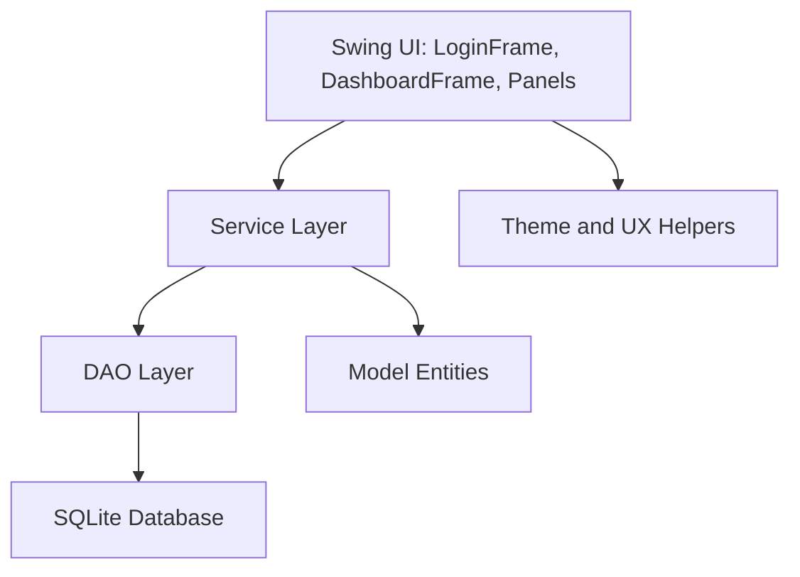
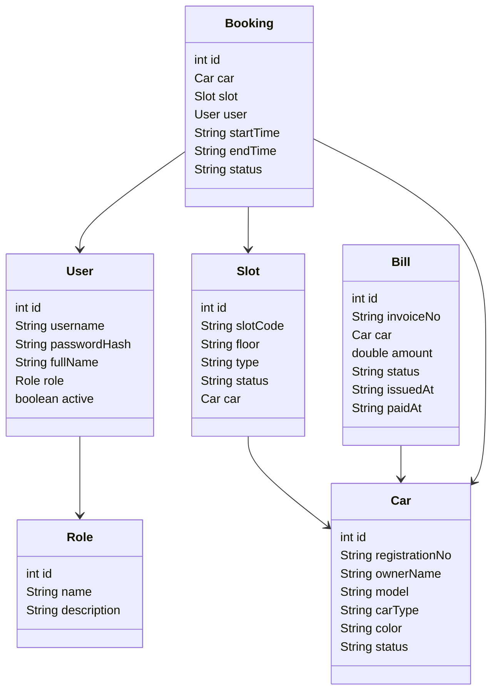

# Parking Management System - Semester Project Report

## Overview

This project is a desktop Parking Management System using Java Swing and SQLite. It follows OOP principles with entities for `User`, `Role`, `Car`, `Slot`, `Bill`, and `Booking`. Persistence is implemented through DAO classes, while service classes handle validation, authentication, billing, and slot operations.

## Project Structure Diagram



## Class Diagram



## Key Classes And Responsibilities

- `Main`: starts database initialization and launches Swing.
- `Database`: central SQLite connection factory.
- `DatabaseInitializer`: creates tables and inserts seed data on first run.
- `PasswordUtil`: hashes and verifies passwords with PBKDF2.
- `AuthService`: validates credentials and returns the authenticated user.
- `AccessControlService`: role-based authorization helper.
- `CarService`, `SlotService`, `BillingService`, `DashboardService`: business operations for each feature area.
- `UserService`: admin user creation, editing, activation, deactivation, and deletion.
- `UserDao`, `CarDao`, `SlotDao`, `BillDao`, `DashboardDao`: SQLite persistence through prepared statements.
- `LoginFrame`, `DashboardFrame`: main application windows.
- `DashboardPanel`, `SlotsPanel`, `BillingPanel`, `CarInfoPanel`: feature screens.

## Sample Code Snippets

### Login Flow

```java
User user = authService.login(usernameField.getText(), new String(passwordField.getPassword()));
new DashboardFrame(user).setVisible(true);
dispose();
```

`AuthService` loads the user by username and verifies the password hash:

```java
if (user.isEmpty() || !user.get().isActive()
        || !PasswordUtil.verifyPassword(password, user.get().getPasswordHash())) {
    throw new IllegalArgumentException("Invalid username or password.");
}
```

### Slot Display And Allocation

```java
for (Slot slot : slotService.allSlots()) {
    String car = slot.getCar() == null ? "-" : slot.getCar().displayName();
    model.addRow(new Object[] {
        slot.getId(), slot.getSlotCode(), slot.getFloor(), slot.getType(), slot.getStatus(), car
    });
}
```

```java
slotService.allocate(slotId, carId);
```

The service layer prevents assigning the same car to more than one occupied slot:

```java
String occupiedSlot = occupiedSlotForCar(connection, carId);
if (occupiedSlot != null) {
    throw new IllegalArgumentException("This car is already parked in slot " + occupiedSlot + ".");
}
```

### Billing Creation And CRUD

```java
double amount = Double.parseDouble(amountField.getText().trim());
billingService.createBill(carId, amount, notesField.getText().trim());
```

`BillingService` validates the amount before saving:

```java
ValidationUtil.requirePositive(amount, "Amount");
return billDao.create(carId, amount, notes);
```

The billing screen also reads all invoices, marks selected invoices paid, and deletes selected invoices:

```java
billingService.allBills();
billingService.markPaid(billId);
billingService.deleteBill(billId);
```

### Car Information Retrieval

```java
Optional<Car> car = carService.findByRegistration(searchField.getText());
car.ifPresent(value -> tableModel.addRow(new Object[] {
    value.getRegistrationNo(), value.getOwnerName(), value.getModel(), value.getColor(), value.getStatus()
}));
```

## SQL Schema

The full schema is in `database/schema.sql`. Core tables:

- `roles`: user role names such as `ADMIN` and `STAFF`.
- `users`: username, password hash, full name, role, active flag.
- `cars`: registration, owner, model, color, status.
- `cars`: registration, owner, model, car type, color, status.
- `slots`: slot code, floor, type, status, assigned car.
- `app_settings`: stores seed/migration flags so deleted sample data does not reappear.
- `bookings`: car, slot, user, start/end time, status.
- `bills`: invoice number, car, booking, amount, payment status.

## Seed Data

The seed script inserts:

- Roles: `ADMIN`, `STAFF`.
- Cars: `ABC-123`, `LHR-7788`, `ICT-550`.
- Slots: `A-01` through `A-12`.
- Default admin account is created by Java with PBKDF2 hashing.

## Run Instructions

1. Install JDK 11 or newer.
2. Add SQLite JDBC as `lib/sqlite-jdbc.jar`.
3. Compile:

```powershell
javac -d out (Get-ChildItem -Recurse src -Filter *.java).FullName
```

4. Run:

```powershell
java -cp "out;lib/sqlite-jdbc.jar" com.parking.Main
```

5. Login with `admin` / `admin123`.

## Non-Functional Coverage

- OOP entities are separated from DAO, service, and Swing layers.
- All database writes use prepared statements.
- Passwords are stored with salted PBKDF2 hashes.
- UI catches validation and database errors and shows user-friendly messages.
- SQLite database is persisted as `parking_management.db`.
- The app uses Swing layouts that resize with the main window.

## Phased Enhancements

1. Improve CRUD for roles and users with admin-only screens.
2. Add booking check-in/check-out history and automatic bill calculation by duration.
3. Add printable invoice and CSV export.
4. Add filters for cars, slots, and bills.
5. Add database backup/restore and stronger audit logging.
